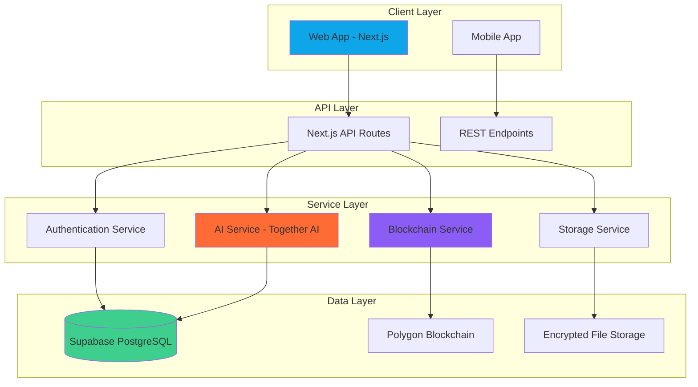

# 🏥 MEDIRA AI Healthcare Platform


<div align="center">


**AI-Powered • Blockchain-Secured • Patient-Centric Healthcare Platform**

[](https://nextjs.org/)
[](https://react.dev/)
[](https://supabase.com/)
[](https://polygon.technology/)
[](https://together.ai/)


</div>

---

## 📋 Table of Contents

- [Overview](#-overview)
- [Features](#-features)
- [Architecture](#-architecture)
- [Tech Stack](#-tech-stack)
- [Getting Started](#-getting-started)
- [Database Setup](#-database-setup)
- [Blockchain Integration](#-blockchain-integration)
- [AI Integration](#-ai-integration)
- [Project Structure](#-project-structure)
- [Security & Compliance](#-security--compliance)
- [Deployment](#-deployment)
- [Contributing](#-contributing)
- [License](#-license)

---

## 🎯 Overview

**MEDIRA AI** is a next-generation healthcare platform that combines cutting-edge artificial intelligence diagnostics with blockchain security to deliver patient-centered healthcare solutions. Our platform empowers patients with complete control over their medical data while providing healthcare professionals with powerful AI-assisted diagnostic tools.

### 🔑 Key Highlights

- 🧍‍♀️ **Patient Data Sovereignty** - Blockchain-based access management puts patients in control
- 🤖 **AI-Powered Diagnostics** - Llama 3 models provide intelligent medical insights
- 🔗 **Immutable Audit Trails** - Polygon blockchain ensures transparent record-keeping
- 🛡️ **HIPAA-Compliant Architecture** - End-to-end encryption and secure data handling
- 📱 **Responsive Design** - Seamless experience across all devices

---

## ✨ Features

### For Patients

- 📊 **Comprehensive Health Dashboard** - Track vital signs, medications, and health metrics
- 🔐 **Granular Access Controls** - Blockchain-powered permission management
- 🗓️ **Smart Appointment Scheduling** - AI-optimized booking system
- 📄 **Digital Health Records** - Secure, portable medical history
- 💊 **Medication Tracking** - Automated reminders and refill alerts
- 📈 **Health Insights** - Personalized recommendations based on your data

### For Healthcare Providers

- 🧠 **AI Diagnostic Assistant** - Real-time clinical decision support
- 📝 **Unified Patient Records** - Comprehensive view of patient history
- 📈 **Analytics Dashboard** - Population health insights and trends
- 🔍 **Medical Image Analysis** - AI-powered radiology assistance
- 📋 **Clinical Documentation** - Automated note-taking and transcription
- 🤝 **Secure Collaboration** - HIPAA-compliant provider communication

### Administrative Features

- 👥 **User Management** - Role-based access control system
- 📊 **Operational Analytics** - Real-time performance metrics
- 🔄 **Workflow Automation** - Streamlined administrative processes
- 📝 **Compliance Reporting** - Automated regulatory documentation
- 🔒 **Audit Logging** - Comprehensive activity tracking

---

## 🏗️ Architecture



### System Components

1. **Frontend Layer** - Next.js 16 with React 19, TailwindCSS, and shadcn/ui
2. **Backend Services** - Serverless API routes with edge computing support
3. **AI Engine** - Together AI integration with Llama 3 models
4. **Blockchain Layer** - Polygon network for access control and audit trails
5. **Database** - Supabase with Row Level Security (RLS)
6. **Storage** - Encrypted file storage with S3-compatible backend

---

## 🛠️ Tech Stack

### Frontend

| Technology | Version | Purpose |
|------------|---------|---------|
| Next.js | 16.x | React framework with App Router |
| React | 19.x | UI library |
| TypeScript | 5.x | Type-safe development |
| TailwindCSS | 3.x | Utility-first styling |
| shadcn/ui | Latest | Component library |
| Framer Motion | 11.x | Animations |

### Backend & Infrastructure

| Technology | Purpose |
|------------|---------|
| Supabase | PostgreSQL database, authentication, storage |
| Next.js API Routes | Serverless backend endpoints |
| Vercel | Deployment platform |

### Blockchain

| Technology | Purpose |
|------------|---------|
| Polygon (Mumbai Testnet) | Layer-2 blockchain network |
| Solidity | Smart contract development |
| ethers.js | Ethereum library |
| Hardhat | Development environment |

### AI/ML

| Technology | Purpose |
|------------|---------|
| Together AI | Inference API |
| Llama 3 (8B/70B) | Language models |
| Custom prompts | Medical domain adaptation |

---

## 🚀 Getting Started

### Prerequisites

- Node.js 18+ or Bun 1.x
- pnpm 8+ (recommended) or npm
- Git
- Supabase account
- Together AI API key
- Polygon wallet (for blockchain features)

### Installation

1. **Clone the repository**
   ```bash
   git clone https://github.com/yllvar/MEDIRA-AI.git
   cd MEDIRA-AI
   ```

2. **Install dependencies**
   ```bash
   pnpm install
   # or
   npm install
   ```

3. **Set up environment variables**
   ```bash
   cp .env.example .env.local
   ```
   
   Edit `.env.local` with your credentials:
   ```env
   # Supabase
   NEXT_PUBLIC_SUPABASE_URL=your_supabase_url
   NEXT_PUBLIC_SUPABASE_ANON_KEY=your_supabase_anon_key
   SUPABASE_SERVICE_ROLE_KEY=your_service_role_key
   
   # Together AI
   TOGETHER_API_KEY=your_together_api_key
   
   # Blockchain
   NEXT_PUBLIC_POLYGON_RPC_URL=https://rpc-mumbai.maticvigil.com
   NEXT_PUBLIC_CONTRACT_ADDRESS=your_contract_address
   PRIVATE_KEY=your_wallet_private_key
   
   # App
   NEXT_PUBLIC_APP_URL=http://localhost:3000
   ```

4. **Run database migrations**
   ```bash
   pnpm db:migrate
   ```

5. **Start the development server**
   ```bash
   pnpm dev
   ```

6. **Open your browser**
   Navigate to [http://localhost:3000](http://localhost:3000)

### Quick Commands

```bash
pnpm dev          # Start development server
pnpm build        # Build for production
pnpm start        # Start production server
pnpm lint         # Run ESLint
pnpm type-check   # TypeScript type checking
pnpm test         # Run tests
```

---

## 💾 Database Setup

### Supabase Configuration

1. **Create a new Supabase project** at [supabase.com](https://supabase.com)

2. **Run the SQL migrations** in the Supabase SQL editor:
   ```sql
   -- Located in /supabase/migrations/
   -- Execute in order: 001_initial_schema.sql, 002_rls_policies.sql, etc.
   ```

3. **Enable Row Level Security (RLS)** on all tables

4. **Configure authentication providers**
   - Enable Email/Password authentication
   - Optional: Set up OAuth providers (Google, GitHub)

### Database Schema

Key tables include:

- `users` - User profiles and authentication
- `patients` - Patient-specific data
- `doctors` - Healthcare provider information
- `appointments` - Scheduling data
- `medical_records` - Health records and documents
- `access_logs` - Blockchain-verified access audit trail
- `ai_interactions` - AI diagnostic session history

---

## ⛓️ Blockchain Integration

### Smart Contract Deployment

1. **Install Hardhat dependencies**
   ```bash
   cd blockchain
   pnpm install
   ```

2. **Configure network settings**
   Edit `hardhat.config.js` with your RPC URL and private key

3. **Compile contracts**
   ```bash
   pnpm hardhat compile
   ```

4. **Deploy to Mumbai testnet**
   ```bash
   pnpm hardhat run scripts/deploy.js --network mumbai
   ```

5. **Update contract address**
   Copy the deployed contract address to `.env.local`

### Smart Contract Features

- **Access Control Management** - Patient-granted permissions
- **Immutable Audit Trail** - Tamper-proof access logs
- **Data Integrity Verification** - Hash-based record validation
- **Permission Revocation** - Instant access removal

---

## 🤖 AI Integration

### Together AI Setup

1. **Get API key** from [together.ai](https://together.ai)

2. **Configure models** in `lib/ai/config.ts`:
   ```typescript
   export const AI_MODELS = {
     diagnostic: 'meta-llama/Llama-3-70b-chat-hf',
     summary: 'meta-llama/Llama-3-8b-chat-hf',
   }
   ```

### AI Capabilities

- **Symptom Analysis** - Intelligent triage and assessment
- **Differential Diagnosis** - Multiple condition suggestions
- **Treatment Recommendations** - Evidence-based guidance
- **Medical Coding** - Automated ICD-10/CPT coding
- **Clinical Documentation** - Note generation and summarization
- **Drug Interaction Checking** - Medication safety analysis

### Usage Example

```typescript
import { generateDiagnosis } from '@/lib/ai/diagnostic'

const result = await generateDiagnosis({
  symptoms: ['fever', 'cough', 'fatigue'],
  vitals: { temperature: 38.5, heartRate: 95 },
  history: ['asthma'],
})
```

---

## 📁 Project Structure

```
MEDIRA-AI/
├── app/                    # Next.js App Router
│   ├── (auth)/            # Authentication pages
│   ├── (dashboard)/       # Protected dashboard routes
│   ├── api/               # API routes
│   └── layout.tsx         # Root layout
├── components/            # React components
│   ├── ui/               # shadcn/ui components
│   ├── patients/         # Patient-specific components
│   ├── doctors/          # Doctor-specific components
│   └── shared/           # Shared components
├── lib/                   # Utility functions
│   ├── ai/               # AI integration
│   ├── blockchain/       # Web3 utilities
│   ├── supabase/         # Database client
│   └── utils/            # Helper functions
├── blockchain/            # Smart contracts
│   ├── contracts/        # Solidity files
│   ├── scripts/          # Deployment scripts
│   └── test/             # Contract tests
├── public/               # Static assets
├── styles/               # Global styles
├── types/                # TypeScript definitions
└── supabase/             # Database migrations
    └── migrations/       # SQL migration files
```

---

## 🔒 Security & Compliance

### HIPAA Compliance

- ✅ End-to-end encryption (AES-256)
- ✅ Secure authentication (JWT + refresh tokens)
- ✅ Audit logging (blockchain-based)
- ✅ Access controls (role-based + patient-granted)
- ✅ Data minimization principles
- ✅ Business Associate Agreements (BAA) with vendors

### Security Measures

1. **Data Encryption**
   - At rest: AES-256 encryption
   - In transit: TLS 1.3
   - Client-side encryption for sensitive fields

2. **Authentication**
   - Multi-factor authentication (MFA)
   - Session management with secure tokens
   - Password hashing with bcrypt

3. **Authorization**
   - Row-level security (RLS) in Supabase
   - Blockchain-based access verification
   - Role-based access control (RBAC)

4. **Monitoring**
   - Real-time threat detection
   - Automated security scanning
   - Incident response procedures

### Compliance Certifications

- HIPAA (Health Insurance Portability and Accountability Act)
- GDPR (General Data Protection Regulation)
- HITECH (Health Information Technology for Economic and Clinical Health)

---

## 🚀 Deployment

### Vercel Deployment (Recommended)

1. **Connect repository to Vercel**
   ```bash
   pnpm dlx vercel
   ```

2. **Configure environment variables** in Vercel dashboard

3. **Deploy**
   ```bash
   pnpm dlx vercel --prod
   ```

### Docker Deployment

```bash
# Build image
docker build -t medira-ai .

# Run container
docker run -p 3000:3000 --env-file .env.local medira-ai
```

### Environment-Specific Configuration

- **Development**: `http://localhost:3000`
- **Staging**: `https://staging.medira.ai`
- **Production**: `https://medira.ai`

---

## 🤝 Contributing

We welcome contributions! Please follow these guidelines:

### Development Workflow

1. **Fork the repository**
2. **Create a feature branch**
   ```bash
   git checkout -b feature/amazing-feature
   ```
3. **Make your changes**
4. **Run tests and linting**
   ```bash
   pnpm lint
   pnpm type-check
   pnpm test
   ```
5. **Commit with conventional commits**
   ```bash
   git commit -m "feat: add amazing feature"
   ```
6. **Push to your fork**
   ```bash
   git push origin feature/amazing-feature
   ```
7. **Open a Pull Request**

### Commit Convention

- `feat:` New features
- `fix:` Bug fixes
- `docs:` Documentation changes
- `style:` Code style changes
- `refactor:` Code refactoring
- `test:` Test additions or modifications
- `chore:` Maintenance tasks

### Code Standards

- Follow TypeScript best practices
- Use Prettier for formatting
- Write meaningful commit messages
- Add tests for new features
- Update documentation as needed

---

## 📄 License

This project is licensed under the MIT License - see the [LICENSE](LICENSE) file for details.

---

## 🙏 Acknowledgments

- [Next.js](https://nextjs.org/) - The React framework
- [Supabase](https://supabase.com/) - Open-source Firebase alternative
- [Together AI](https://together.ai/) - AI inference platform
- [Polygon](https://polygon.technology/) - Ethereum scaling solution
- [shadcn/ui](https://ui.shadcn.com/) - Re-usable component library

---

<div align="center">

**Built with ❤️ by the MEDIRA Team**
